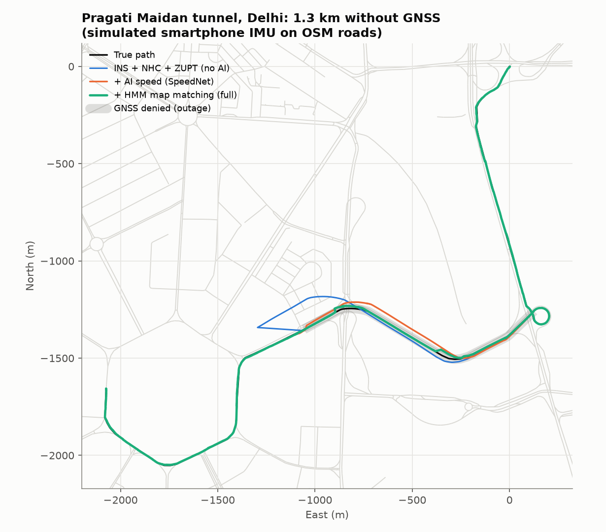
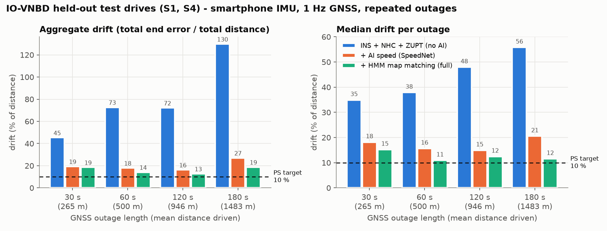

# DrishtiNav — AI-ML Intelligent Dead Reckoning with seamless GNSS + INS fusion

**ISRO · Smart India Hackathon 2026 · Problem Statement 26168 ("AI-ML based Intelligent
Dead Reckoning system for seamless navigation") · Team Paradigm**

**🔴 Live site → https://drishtinav.vercel.app**
**⚙️ Live engine API → https://drishtinav-engine.onrender.com/api/health**

No install needed to evaluate it — open the live site, pick a scenario, press **RUN**.
Everything below explains what it does, why, how it was built, and how to check every
number yourself.

---

## 1. The problem, in one line

Phone-based navigation (Google Maps, MapmyIndia) relies on GNSS. Inside a tunnel, a
multi-level car park, or an urban canyon between tall buildings, GNSS drops out
entirely, and the app freezes or jumps. PS 26168 asks for a system that keeps a vehicle
navigating through that blackout using only the phone's own IMU (accelerometer +
gyroscope, no OBD-II, no speedometer link), snaps back onto the road on an offline map,
and switches between GNSS-aided and GNSS-denied modes **seamlessly**, in milliseconds —
plus an edge-deployable version of the same algorithms for external/FOG-grade IMUs at
up to 200 Hz.

## 2. What we built, mapped to every PS requirement

Full requirement-by-requirement detail, with the v0 (pre-rework) prototype compared
line by line against what's here now, is in **[docs/GAP_ANALYSIS.md](docs/GAP_ANALYSIS.md)**.
Short version:

| PS asks for | What's here |
|---|---|
| Train & test on **IO-VNBD**, with position plots on a subset | Real loader + a from-scratch fix for the dataset's own sync bugs (see §5); 330 km of usable drives, drive-level train/val/test split; plots in `results/plots/` |
| **AI/ML predicts vehicle speed** from phone accel/gyro only (no OBD) | **SpeedNet** — an 18.8k-parameter temporal CNN, trained on real IO-VNBD driving, predicting speed *and its own calibrated uncertainty* |
| Filter engine-idle vibration, potholes, phone-mount misalignment | Vibration low-pass, pothole/bump detector, and an **online mount-alignment engine** that learns pitch/roll/yaw of the phone in its holder and detects if it's knocked mid-drive |
| **Non-holonomic constraints** (car doesn't slide sideways / fly) | Built directly into the vehicle EKF's process model |
| **AI-based GNSS+INS fusion** to cut drift | EKF whose AI-speed measurement noise *is* SpeedNet's own predicted uncertainty (AI-adaptive fusion, à la AI-IMU Dead-Reckoning) |
| **Map matching** on an offline map (e.g. OSM), e.g. HMM | Newson–Krumm-style causal HMM forward filter over a locally-stored OpenStreetMap graph (`scripts/fetch_osm.py`) — genuinely offline, no live tile/geocoding API at inference time |
| **Seamless GNSS-deficit handler**, switches within milliseconds | 5-state handler (`GNSS ⇄ DEGRADED → DR → RECOVERY → GNSS`); INS keeps running every single IMU sample so there is never a gap in the output — unit-tested to prove no position jump at the switch |
| **Edge-deployable engine** for any external IMU, ~10 Hz phone / ~200 Hz FOG | `drishtinav/` is a standalone, numpy-only Python package with a CLI (`python -m drishtinav run ...`) and documented profiles for phone / MEMS / FOG-grade IMUs |
| Drift **< 10 % of distance** in GNSS blackout | Median outage meets this at 60 s / 120 s / 180 s on real held-out IO-VNBD drives, and the simulated 1.35 km tunnel passes on **9 / 10 (phone) and 10 / 10 (FOG) random seeds** — full numbers in §4 |

## 3. Try it right now (no setup)

Open **https://drishtinav.vercel.app**.

1. Pick a scenario from the dropdown:
   - **Delhi – Pragati Maidan tunnel** (phone or FOG IMU): a physics-based simulation
     driven along the *real* 1.3 km Pragati Maidan tunnel road geometry (pulled from
     OpenStreetMap), with GNSS cut for the whole tunnel and degraded by multipath at
     the portals.
   - **IO-VNBD S1 / S4**: two real, held-out (never trained on) smartphone recordings
     from the IO-VNBD benchmark dataset, with GNSS outages of your chosen length
     injected.
2. Press **RUN** — this instantly loads a precomputed result (three ablations: plain
   INS, +AI speed, +map matching) so you see the full animated trajectory, live
   telemetry, drift charts and per-outage table with zero wait.
3. Press **⚡ Re-run live** to recompute the full pipeline from raw sensor data on the
   deployed Python engine (`drishtinav-engine.onrender.com`) with a fresh random noise
   seed, proving the numbers aren't cherry-picked precomputed files. **The engine is on
   Render's free tier — a request takes roughly 1–2 minutes of actual compute**, not
   because the server is "waking up" but because it's genuinely re-running IMU
   calibration, the EKF and HMM map matching sample-by-sample over the whole drive on a
   shared free CPU. Locally the same computation takes 3–5 seconds (§7 has real
   throughput numbers).
4. Scroll down to the **IO-VNBD benchmark** section for the full outage-length table
   and the SpeedNet accuracy numbers, computed the same way.

You can also call the engine API directly:
```bash
curl https://drishtinav-engine.onrender.com/api/health
curl "https://drishtinav-engine.onrender.com/api/run?scenario=sim:delhi_pragati_tunnel:smartphone&seed=42&configs=full"
# upload your own IMU recording (generic CSV format, see docs/EDGE_ENGINE.md):
curl -X POST --data-binary @your_drive.csv "https://drishtinav-engine.onrender.com/api/navigate?profile=smartphone"
```

## 4. Results (numbers you can check yourself)

Everything here is generated by committed scripts against committed raw data
(`results/*.json`, `results/*_log.txt`) — nothing is hand-typed. Full breakdown,
methodology and an engineering log of what went wrong along the way (including a
scoring bug we found and fixed) is in **[docs/RESULTS.md](docs/RESULTS.md)**.

**IO-VNBD held-out test drives** (S1, S4 — 35 km, phone IMU only, never trained on):

| Outage length | Plain INS + NHC | + AI speed (SpeedNet) | **+ map matching (full)** |
|---|---|---|---|
| 30 s (265 m) | 34.9 % median drift | 18.2 % | **15.2 %** · 28 % of outages pass |
| 60 s (500 m) | 37.9 % | 15.6 % | **10.9 %** · 44 % pass |
| 120 s (946 m) | 47.9 % | 14.9 % | **12.5 %** · 39 % pass |
| 180 s (1483 m) | 55.8 % | 20.5 % | **11.5 %** · 33 % pass |

**Simulated Pragati Maidan tunnel** (1.35 km GNSS-denied, 10 random noise seeds):

| Sensor | Plain INS + NHC | **Full pipeline (AI + map)** |
|---|---|---|
| Smartphone IMU @ 10 Hz | 31.1 % mean drift, 0/10 seeds pass | **3.1 % mean · 1.4 % median**, **9/10 seeds pass** |
| FOG IMU @ 200 Hz (edge engine) | 0.84 % mean | **0.39 % mean · 0.21 % median**, **10/10 seeds pass** |

Drift = position error the instant before the first recovery GNSS fix ÷ distance driven
during the outage. PS target is < 10 %.




## 5. Architecture — how it works end to end

Full detail with state-space equations, every measurement model and every tuned
constant: **[docs/ARCHITECTURE.md](docs/ARCHITECTURE.md)**.

```
IMU (accel, gyro) ──► calibration.py ──► alignment.py ──► features.py + SpeedNet ──► fusion.py (EKF) ──► pose
  10–400 Hz            vibration LPF      mount pitch/       AI speed + its own      NHC built in,        (lat, lon,
                        ZUPT / bump         roll/yaw,          uncertainty (TCN,      AI-adaptive GNSS      heading,
GNSS fix (optional) ──► detection           gyro-axis fix,     20 s window,           noise, map            speed,
  1 Hz, or none                             mount-slip         ~18.8k params)         constraints           mode, σ)
                                            detection                                  (fusion.py)
                                                                                            ▲
                                                                                    mapmatch.py: HMM forward
                                                                                    filter over roadnet.py
                                                                                    (offline OpenStreetMap graph)
```

One streaming `NavEngine.step()` call per IMU sample. The INS mechanisation runs on
*every* sample regardless of GNSS state — GNSS is only ever a correction — which is
what makes the mode switch instantaneous instead of a re-initialisation.

**Everything here is real, not a mock**: SpeedNet is a real PyTorch model trained on
real recorded driving data and exported to ONNX/JSON/numpy; the EKF and HMM map matcher
are from-scratch implementations of the published algorithms (not library calls); the
"offline map" is an actual OpenStreetMap road graph pulled once via Overpass and stored
as JSON, used with zero network calls at inference time; the phone app's JavaScript
engine (`web/mobile/engine.js`) is a hand-ported, numerically-verified 1:1 copy of the
Python engine, not a UI shell that calls a server.

## 6. How we built it, end to end

1. **Inherited a synthetic-only prototype** that faked its own GNSS noise, scored drift
   only after GNSS had already returned (so every run "passed"), and had map matching
   snap to its own GNSS track (so it couldn't help). Findings and gap analysis in
   [docs/GAP_ANALYSIS.md](docs/GAP_ANALYSIS.md).
2. **Got IO-VNBD working.** The published "synchronised" phone/vehicle file pairs are
   *not* synchronised (offsets up to 26 s that jump mid-file), the phone clock resets
   mid-recording, and the gyro columns are permuted relative to the accelerometer.
   Wrote a chunked cross-correlation resync pass and verified it against known-offset
   synthetic data (unit test). Full writeup: [docs/DATASET.md](docs/DATASET.md).
3. **Trained SpeedNet** on 330 km of the fixed data with a strict drive-level
   train/val/test split, augmenting for mount-angle and sensor-noise robustness.
4. **Built the navigation engine from published algorithms**, not from a black box:
   mount alignment (Wahlström et al.; Chen, Zhang & Niu), an EKF with the
   non-holonomic constraint baked into the process model, a GNSS-deficit state
   machine, and a causal HMM map matcher (Newson & Krumm). Research citations for
   every design choice: [docs/RESEARCH.md](docs/RESEARCH.md).
5. **Simulated the actual tunnel** the PS's benchmark example describes (Delhi's real
   1.3 km Pragati Maidan tunnel), routing a physics-based vehicle+IMU simulator along
   its real OpenStreetMap road geometry, so the demo isn't an abstract "GPS off for N
   seconds" toggle.
6. **Built a benchmark harness and ran it** — repeatedly injected outages on held-out
   real drives and on 10 random noise seeds of the tunnel simulation. Found and fixed a
   real scoring bug mid-project (an off-by-one in "error at end of outage" that made
   every number look better than the algorithm actually achieved) — documented, not
   hidden, in [docs/RESULTS.md §6](docs/RESULTS.md).
7. **Ported the whole engine to JavaScript** (`web/mobile/engine.js`) so it can run
   on-device in a browser/phone context, and wrote a parity harness
   (`tests/js/parity.mjs`) that runs both implementations on the same recording and
   diffs the output.
8. **Built the dashboard and deployed it**: a static Vercel site serving precomputed
   results instantly, backed by the same Python engine running live on Render for
   on-demand re-computation with fresh random seeds — so what you see live is provably
   the same code as what generated the numbers in this README.

## 7. Run it yourself

**Locally**, no cloud needed:

```bash
pip install -r requirements.txt
python -m drishtinav serve            # dashboard: http://localhost:5000
```
(Windows: double-click `run.bat`. It creates a venv, installs requirements, and opens
the dashboard.)

**Reproduce every number in this README from scratch:**

```bash
pip install -r requirements-train.txt
python scripts/download_iovnbd.py                        # ~280 MB of IO-VNBD drives -> ~/iovnbd/raw
python training/train_speednet.py --win 200 --epochs 15  # trains SpeedNet -> models/ (~7 min on CPU)
python scripts/benchmark.py                               # IO-VNBD outage benchmark -> results/
python scripts/benchmark_synthetic.py --seeds 10          # Delhi tunnel, 10 noise realisations
python scripts/make_plots.py                               # figures -> results/plots/
python -m pytest                                           # 19 tests
python tests/js/export_drive.py > drive.json && node tests/js/parity.mjs drive.json   # JS == Python
```

**Edge engine / CLI** (works with any IMU CSV, not just phones):
```bash
python -m drishtinav run --input your_drive.csv --profile fog --roads data/osm/delhi_central.json
```
See [docs/EDGE_ENGINE.md](docs/EDGE_ENGINE.md) for the CSV format and all profiles, and
[docs/MOBILE_APP.md](docs/MOBILE_APP.md) for the installable phone-app prototype in
`web/mobile/` (live sensors, on-device inference, offline caching — a secondary
deliverable to the main dashboard above).

## 8. Deployment (for maintainers)

- **`drishtinav.vercel.app`** — static export (`scripts/build_static.py` →
  `site/`) of the dashboard, phone app, offline OSM road databases and every
  precomputed engine result, deployed via `vercel deploy --prod` from `site/`.
- **`drishtinav-engine.onrender.com`** — the same `drishtinav` Python package, served
  live by Flask/Gunicorn (`server/app.py`) per `render.yaml`, auto-deploying from this
  repo on push. Provides `/api/run` (recompute any scenario with a fresh seed) and
  `/api/navigate` (POST any IMU CSV, get a navigated track back).
- Redeploy after a code change: `python scripts/build_static.py --engine
  https://drishtinav-engine.onrender.com && cd site && vercel deploy --prod`; Render
  redeploys automatically on push to the tracked branch.

## 9. Repository layout

```
drishtinav/            edge engine (numpy only) — the actual navigation algorithms
  engine.py              NavEngine.step(): the per-IMU-sample pipeline
  alignment.py            mount levelling, yaw mount, gyro axis, mount-slip detection
  calibration.py          vibration filter, ZUPT/stationary and pothole detectors
  features.py              SpeedNet input channels;  models/speednet.py  numpy runtime
  fusion.py                vehicle EKF (NHC, GNSS, ZUPT/ZARU, AI speed, map constraints)
  gnss_handler.py           GNSS / DEGRADED / DR / RECOVERY state machine
  mapmatch.py               HMM map matching;  roadnet.py  offline OSM graph + routing
  io/                       IO-VNBD loader + resync, generic CSV, OSM-based simulator
  evaluation.py             outage benchmark harness;  cli.py  command line
training/               SpeedNet dataset builder + training/export (PyTorch)
models/                 speednet.npz / .json / .onnx + accuracy metrics
server/                 Flask app (dashboard + phone app + live engine API) and datagen.py
web/dashboard/          evaluation dashboard (what you see at the live URL)
web/mobile/             phone PWA — engine.js is a verified 1:1 JS port of drishtinav/
data/osm/               offline road databases (Delhi, Coventry);  data/demo/  bundled IO-VNBD test drives
scripts/                dataset download, OSM fetch, benchmarks, tuning, plots, static-site build
results/                benchmark tables (JSON + raw logs), figures
docs/                   GAP_ANALYSIS · RESULTS · ARCHITECTURE · DATASET · RESEARCH · EDGE_ENGINE · MOBILE_APP
tests/                  19 pytest tests + JS/Python parity harness
```

## 10. Data & licences

IO-VNBD © Onyekpe et al. — see <https://github.com/onyekpeu/IO-VNBD> for its terms;
only two small resynchronised test segments are included in `data/demo/` for the demo.
Map data © OpenStreetMap contributors (ODbL).
