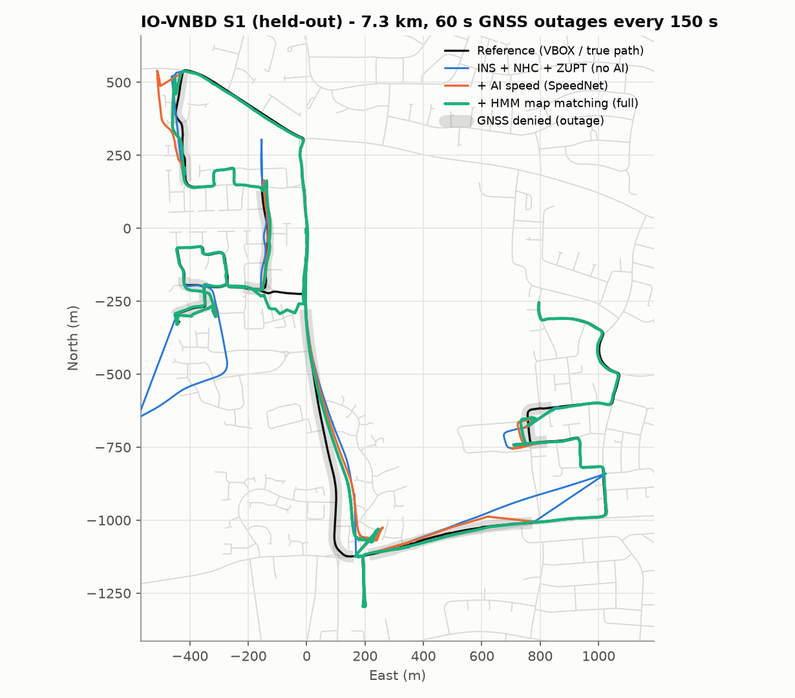

# DrishtiNav — AI-ML Intelligent Dead Reckoning with seamless GNSS + INS fusion

**ISRO · Smart India Hackathon 2026 · Problem Statement 26168 · Team Paradigm**

When a vehicle enters a tunnel, an underpass or an urban canyon, GNSS disappears and
phone navigation freezes or jumps. DrishtiNav keeps navigating on the phone's own
accelerometer and gyroscope, with **no connection to the vehicle**:

* an **alignment engine** learns how the phone sits in its holder (pitch, roll, yaw,
  even permuted sensor axes) and notices when it is knocked;
* **SpeedNet**, a small temporal CNN trained on IO-VNBD, estimates forward speed and its
  own uncertainty from 20 s of IMU data (the missing speedometer), and recognises
  stops despite engine vibration;
* a vehicle **EKF with built-in non-holonomic constraints** fuses GNSS when present and,
  when it is lost, switches in the same epoch to AI dead reckoning, with SpeedNet's σ as
  its measurement noise;
* an **HMM map matcher** on an offline OpenStreetMap database keeps the car on the road
  grid;
* the same engine runs **on the phone** (installable PWA, on-device inference) and as an
  **edge engine** for external IMUs up to 200 Hz (FOG).

## Results

| Scenario | GNSS-denied distance | INS + NHC (no AI) | **DrishtiNav (full)** |
|---|---|---|---|
| IO-VNBD held-out drives, phone IMU, 60 s outages | 500 m avg | 16.0 % median · 44 % aggregate | **5.6 % median** · 14.9 % aggregate |
| IO-VNBD held-out drives, phone IMU, 180 s outages | 1 484 m avg | 21.7 % median · 103 % aggregate | **5.0 % median** · 13.6 % aggregate |
| Pragati Maidan tunnel, Delhi (simulated, 10 seeds), phone @10 Hz | 1 354 m | 31.1 % mean | **8.0 % mean** (8/10 seeds < 10 %) |
| Same tunnel, FOG IMU @200 Hz (edge engine) | 1 354 m | 0.84 % mean | **0.63 % mean** (≈ 8.5 m, all seeds < 2 %) |

Drift = position error at the end of the outage ÷ distance driven without GNSS (PS
target < 10 %). The typical (median) outage meets the target at every length. The
aggregate is still 12–15 % on IO-VNBD's wobbly phone holders: see
[docs/RESULTS.md](docs/RESULTS.md) for every number and its limitations, and
[docs/GAP_ANALYSIS.md](docs/GAP_ANALYSIS.md) for requirement-by-requirement coverage.



## Quick start

**Windows:** double-click `run.bat` (creates `.venv`, installs requirements, opens the dashboard).

**Linux / macOS:**

```bash
./run.sh                    # dashboard on http://localhost:5000, phone app on /app/
./run.sh --https            # serve over HTTPS so a phone on the same Wi-Fi can use its sensors
```

Or manually: `pip install -r requirements.txt && python -m drishtinav serve`.

* **Dashboard** (`/`): pick the Delhi tunnel (phone or FOG) or a bundled IO-VNBD test
  drive, press RUN: the engine runs three ablations, and you get the map, animated
  vehicle, error and speed charts, per-outage table and the benchmark tables.
* **Phone app** (`/app/`): *Replay demo* runs a recorded drive through the on-device
  engine; *Live* uses the phone's sensors; *Simulate GNSS outage* shows the tunnel
  behaviour anywhere; *Record* saves your drive for training.
  See [docs/MOBILE_APP.md](docs/MOBILE_APP.md).
* **Edge engine / CLI**: `python -m drishtinav --help`.
  See [docs/EDGE_ENGINE.md](docs/EDGE_ENGINE.md).

## Reproduce everything

```bash
pip install -r requirements-train.txt
python scripts/download_iovnbd.py                        # ~280 MB of IO-VNBD drives -> ~/iovnbd/raw
python training/train_speednet.py --win 200 --epochs 15  # SpeedNet -> models/ (~7 min on CPU)
python scripts/benchmark.py                              # held-out outage benchmark -> results/
python scripts/benchmark_synthetic.py --seeds 10         # Delhi tunnel, 10 noise realisations
python scripts/make_plots.py                             # proposal figures -> results/plots/
python -m pytest                                         # 19 tests
python tests/js/export_drive.py > drive.json && node tests/js/parity.mjs drive.json   # phone engine == Python engine
```

## Repository layout

```
drishtinav/            edge engine (numpy only)
  engine.py            NavEngine.step(): the per-sample pipeline
  alignment.py         levelling, yaw mount, gyro axis, mount-slip detection
  calibration.py       vibration filter, stationary (ZUPT) and pothole detectors
  features.py          SpeedNet input channels
  models/speednet.py   numpy SpeedNet runtime
  fusion.py            vehicle EKF (NHC, GNSS, ZUPT/ZARU, AI speed, map constraints)
  gnss_handler.py      GNSS / DEGRADED / DR / RECOVERY state machine
  mapmatch.py          HMM map matching;  roadnet.py  offline OSM graph + index
  io/                  IO-VNBD loader + resync, generic CSV, OSM-based simulator
  evaluation.py        outage benchmark harness;  cli.py  command line
training/              dataset builder + SpeedNet training/export (PyTorch)
models/                speednet.npz / .json / .onnx + metrics
server/app.py          Flask API for the dashboard and phone app
web/dashboard/         evaluation dashboard;   web/mobile/  phone PWA (engine.js = JS port)
data/osm/              offline road databases (Delhi, Coventry);  data/demo/  bundled test drives
scripts/               download, OSM fetch, benchmarks, tuning (validation only), plots
results/               benchmark tables, plots
docs/                  GAP_ANALYSIS · RESULTS · ARCHITECTURE · DATASET · RESEARCH · EDGE_ENGINE · MOBILE_APP
tests/                 pytest suite + JS parity harness
```

## Data & licences

IO-VNBD © Onyekpe et al. — see <https://github.com/onyekpeu/IO-VNBD> for its terms; only
two small resynchronised test segments are included in `data/demo/` for the demo. Map data
© OpenStreetMap contributors (ODbL).
