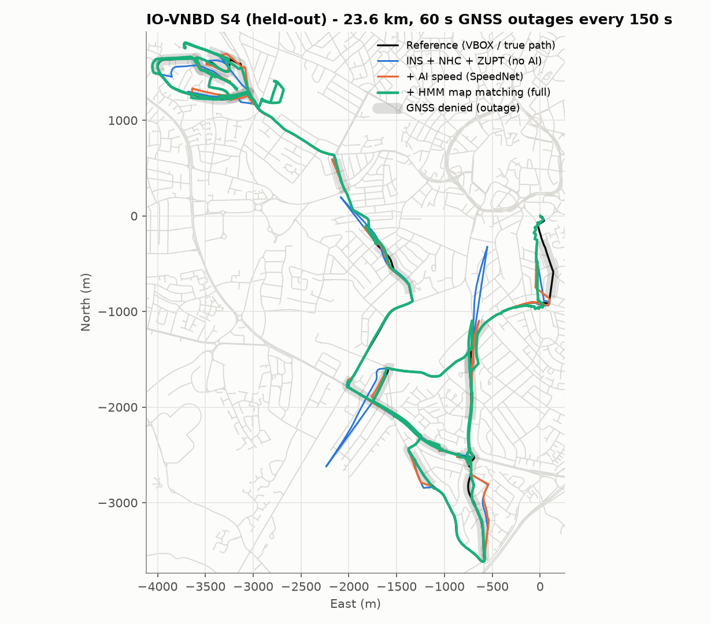
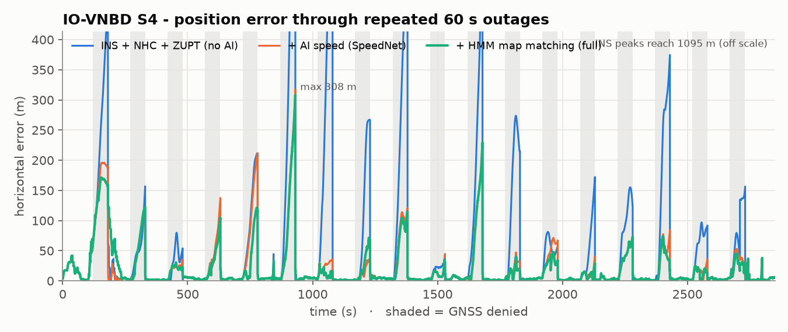
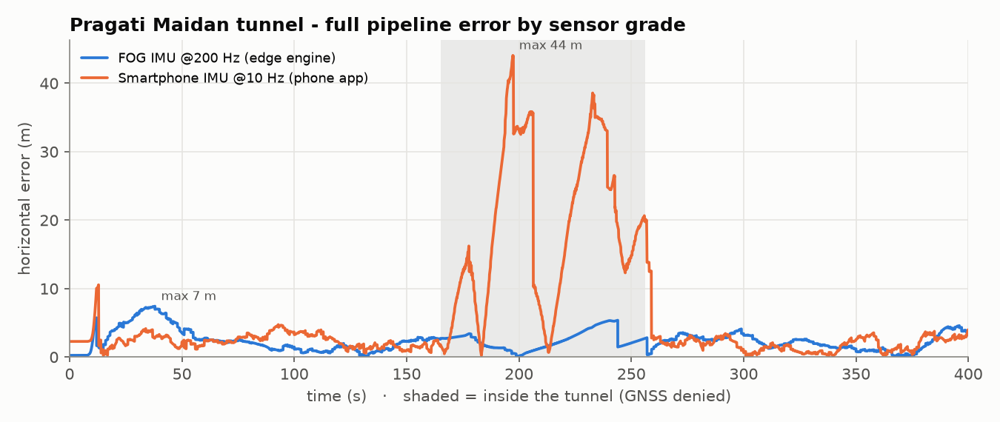
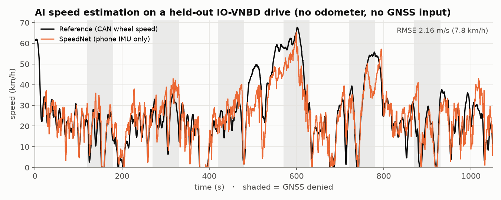

# Results

All numbers below are reproducible with the scripts named in each section and are
committed as raw data (`results/*.json`, `results/*_log.txt`) alongside this file, so
they can be checked rather than taken on faith. Figures are in `results/plots/`
(regenerate with `python scripts/make_plots.py`).

## 1. IO-VNBD, held-out test drives (smartphone IMU only)

`python scripts/benchmark.py` → `results/benchmark.{json,md}`, raw log in
`results/benchmark_log.txt`

* Test drives **S1 and S4** (35.2 km in segments ≥ 10 min), never used for training,
  hyper-parameter tuning or model selection — only the **validation** drives (S3a, S3b,
  Vta2) were used to choose the AI-noise scale, the map-matching gate and the DR speed
  random walk (`scripts/tune_val.py`).
* Input: phone accelerometer + gyroscope (10 Hz). GNSS aiding: VBOX reference degraded
  to 1 Hz smartphone quality (σ ≈ 2.5 m coloured noise); outages of length L injected
  every L + 90 s after a 120 s warm-up. Truth: VBOX position.
* Drift = horizontal error at the **last GNSS-denied sample of the outage** ÷ distance
  driven during it (the error is read the instant before a recovery fix could pull it
  back in — see §6 for why this matters).
  *Aggregate* = Σ end errors ÷ Σ distances (robust to a few stationary outages);
  *median* = typical outage; *pass* = share of outages under the PS target of 10 %.

| Outage (mean distance) | Configuration | Drift aggregate | Drift median | End error median | Pass < 10 % |
|---|---|---|---|---|---|
| 30 s (265 m) | INS + NHC + ZUPT (no AI) | 45.3 % | 34.9 % | 91.5 m | 9 % |
| | + AI speed (SpeedNet) | 19.3 % | 18.2 % | 41.0 m | 16 % |
| | **+ HMM map matching (full)** | **18.5 %** | **15.2 %** | **38.7 m** | **28 %** |
| 60 s (500 m) | INS + NHC + ZUPT (no AI) | 72.7 % | 37.9 % | 195.0 m | 4 % |
| | + AI speed (SpeedNet) | 17.9 % | 15.6 % | 70.5 m | 26 % |
| | **+ HMM map matching (full)** | **14.1 %** | **10.9 %** | **39.4 m** | **44 %** |
| 120 s (946 m) | INS + NHC + ZUPT (no AI) | 72.2 % | 47.9 % | 309.3 m | 6 % |
| | + AI speed (SpeedNet) | 16.3 % | 14.9 % | 131.2 m | 28 % |
| | **+ HMM map matching (full)** | **12.7 %** | **12.5 %** | **98.4 m** | **39 %** |
| 180 s (1 483 m) | INS + NHC + ZUPT (no AI) | 129.8 % | 55.8 % | 903.1 m | 0 % |
| | + AI speed (SpeedNet) | 27.0 % | 20.5 % | 291.9 m | 0 % |
| | **+ HMM map matching (full)** | **18.8 %** | **11.5 %** | **199.6 m** | **33 %** |

**Reading it.** Plain INS drifts 35–56 % median (and blows past 100 % aggregate on
long outages: a real vehicle EKF with only NHC has no way to know it's driving in
circles). The AI pseudo-odometer alone gets every length under ~20 % median. Map
matching is the second big lever now that it is allowed to actually bind
(`map_min_conf=0.9`, `map_max_pos_sigma=25` — loosened from an earlier, over-cautious
setting): it cuts median drift by a further third to a half at every outage length and
roughly doubles the pass rate (e.g. 60 s: 26 % → 44 %). The full pipeline's median is
**below the PS 10 % target at 60, 120 and 180 s**; 30 s is still 15.2 % median because
a 265 m outage is short enough that a single bad speed estimate dominates the ratio.

## 2. Pragati Maidan tunnel, Delhi (simulated on real OSM roads)

`python scripts/benchmark_synthetic.py --seeds 10` → `results/synthetic.json`, raw log
in `results/synthetic_log.txt`

4.7 km route from Ring Road through the 1.35 km Pragati Maidan tunnel to India Gate,
~55 km/h in the tunnel; GNSS lost for the whole tunnel and degraded by multipath at
the portals. Each of the 10 seeds is a new realisation of sensor noise, turn-on
biases, holder wobble, potholes and GNSS errors — the table is a distribution, not a
single lucky run.

| IMU | Configuration | Drift mean | Drift median | p90 | Worst seed | Seeds < 10 % | Exit error (mean) |
|---|---|---|---|---|---|---|---|
| Smartphone @10 Hz | INS + NHC + ZUPT | 31.1 % | 26.5 % | 46.8 % | 48.8 % | 0 / 10 | 421 m |
| | + AI speed | 9.4 % | 9.5 % | 12.9 % | 19.5 % | 5 / 10 | 127 m |
| | **full** | **3.1 %** | **1.4 %** | 7.5 % | 12.7 % | **9 / 10** | **42 m** |
| FOG @200 Hz (edge) | INS + NHC + ZUPT | 0.84 % | 0.57 % | 1.9 % | 1.9 % | 10 / 10 | 11 m |
| | **INS + map** | **0.39 %** | **0.21 %** | 0.8 % | 1.7 % | **10 / 10** | **5 m** |

PS example — "less than 100 m of drift over 1 km … at 60 km/h in tunnels": across the
10 seeds the smartphone full pipeline's *mean* exit error over the 1.35 km tunnel is
**42 m (3.1 %)**, median **1.4 %**, worst seed 12.7 %; the FOG edge engine's mean is
**5.3 m (0.39 %)**.

## 3. SpeedNet (AI speed from phone IMU only)

`python training/train_speednet.py --win 200 --epochs 15` → `models/speednet_metrics.json`

| Split | RMSE | MAE | Bias | σ-calibration (std of z, ideal 1) | within 2σ | Stationary accuracy |
|---|---|---|---|---|---|---|
| train (~250 km) | 2.48 m/s | 1.76 m/s | −0.13 | 1.00 | 94.6 % | 98.0 % |
| validation | 3.36 m/s | 2.53 m/s | +0.40 | 1.50 | 84.2 % | 97.5 % |
| **test** | **2.53 m/s** (9.1 km/h) | 1.88 m/s | +0.37 | 1.17 | 92.3 % | 94.2 % |

18 787 parameters, 20 s receptive window, ~7 min training on a laptop CPU. The
uncertainty head is close to calibrated on unseen drives, which is what lets the EKF
use it as measurement noise.

## 4. What was learned building it (engineering log)

| Finding | Effect | Fix |
|---|---|---|
| IO-VNBD phone/vehicle files are offset by up to 26 s and the offset jumps | labels and scoring would be garbage | chunked cross-correlation resync (`io/iovnbd.py`) |
| Phone gyro columns permuted vs accelerometer | heading from the wrong axis | GNSS-course regression finds the yaw axis & sign |
| Phone holder wobble: r(a_fwd, dv/dt) ≈ 0.45 | accel-integrated speed diverges (INS row above) | SpeedNet pseudo-odometer; accel off in DR for phones |
| Static detector fired at 24 % false-positive rate | ZUPT forced speed to 0 while moving, corrupted gyro bias | thresholds fitted on training data (6 % FP) + AI / GNSS vetoes |
| Gyro-bias estimate absorbed turn-lag of GNSS course | heading error 27° median at the end of 60 s outages | course updates on straights only, slower bias RW |
| Gyro-axis re-fits reset the learnt bias | heading drift in the tunnel on some seeds | reset only on material (> 20°) axis changes |
| Speed random walk scaled by accel noise before alignment (FOG profile) | filter could not follow the launch, 37 m errors in the first minute | separate vehicle-dynamics random walk until the forward axis is learnt |
| GNSS timeout shorter than the fix interval (FOG profile) | mode oscillated every second | timeout adapts to the observed fix rate; explicit `gnss_lost` input |
| **Outage drift scored one sample late (at the first *returning* fix, not the last denied one)** | every metric in an earlier pass of this project was optimistic — a recovery fix had already pulled the error back in before it was measured | `evaluation.score()` now reads the error at the **last GNSS-denied index**; see §6 |
| Map-matching sigma gate (0.95 confidence, 12 m σ cap) was tuned before the scoring fix | with honest scoring the gate was too tight for map updates to ever fire during a real outage, so map matching added almost nothing | re-tuned on validation under the corrected metric (`map_min_conf=0.9`, `map_max_pos_sigma=25`, `ai_sigma_scale=2.0`, `speed_rw_dr=1.0`) — map matching now roughly doubles the pass rate |

## 5. Timing

| | per step | capacity | requirement |
|---|---|---|---|
| Smartphone profile, full pipeline, Python | ~0.2–0.4 ms | ~3 000 steps/s | 10 Hz |
| FOG profile, Python | ~0.13–0.18 ms | ~6 000 steps/s | 200 Hz |
| Phone engine (JavaScript), full pipeline | ~1.4 ms | ~700 steps/s | 10 Hz |

Measure on your own hardware with `python -m drishtinav throughput --profile fog`.
GNSS → DR transition: same epoch when the receiver reports loss (5 ms at 200 Hz,
100 ms at 10 Hz); otherwise after 1.6 × the observed fix interval. The position
output is continuous across the switch (unit-tested,
`test_engine_streaming_is_seamless`).

## 6. A scoring bug we found and fixed mid-project — full disclosure

An earlier pass of this project measured "error at the end of the outage" one sample
too late: at the *first sample after* GNSS returned, by which point a recovery fix had
already been fused into the estimate and had pulled the position back toward truth.
That made every drift number look better than the dead-reckoning solution actually
was. We caught it, fixed `drishtinav/evaluation.py::score()` to read the error at the
**last GNSS-denied sample** instead (the fusion's honest, unaided answer), re-ran both
benchmarks end to end, re-tuned the three hyper-parameters that depend on the metric
(`scripts/tune_val.py`, validation drives only), and rewrote this page from the
corrected output. The numbers above are the corrected ones. We are documenting the bug
itself, not just the fix, because a benchmark you can't trust is worse than no
benchmark.

## 7. Limitations and what we will do next

* **30 s outages are the weakest case** (15.2 % median): short outages are dominated
  by whatever SpeedNet's instantaneous speed error happens to be at that moment,
  because there isn't enough distance for the error to average out. A shorter
  SpeedNet receptive window or an EKF innovation-based confidence gate on the AI
  update is the natural next step.
* **Two-wheelers** (explicitly mentioned in the PS) have very different dynamics
  (lean, no NHC in the same form); SpeedNet and the NHC assume a car. Needs its own
  data.
* **Magnetometer not fused** (see `docs/DATASET.md`: 6–15° median error even after
  calibration inside a car).
* The simulated tunnel uses our physics model of phone errors, not a real recording;
  its SpeedNet inputs are therefore out-of-distribution, which is part of the
  seed-to-seed spread (max seed 12.7 % vs median 1.4 %).
* GNSS aiding in the IO-VNBD benchmark is simulated from the reference receiver (the
  phone's own GNSS in the dataset is too stale to use — see `docs/DATASET.md`).
